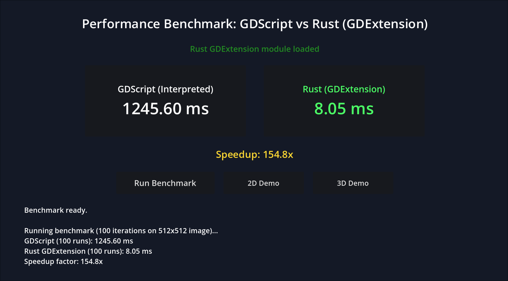

# Godot Scratch Card Addon

Godot 4 plugin for 2D and 3D scratch cards based on `SubViewport` mask rendering. It includes zone tracking, state serialization to PNG, custom brush textures, and an optional Rust GDExtension for faster pixel percentage counting (with automatic GDScript fallback).

## Features

- Supports both 2D (`ScratchCard2D`) and 3D (`ScratchCard3D` with raycasting).
- Brush customization (texture, hardness, opacity, and stroke interpolation for smooth mouse/touch inputs).
- `ScratchZone` sub-rectangles with validation thresholds, signal notifications, and auto-reveal options.
- Configurable threshold (0–255) for alpha and brightness detection.
- Methods for programmatic scratching (`scratch_circle`, `scratch_rect`, `scratch_random`, `reveal_all`).
- State save and restore (`save_state` / `restore_state`) storing PNG mask buffers and zone completion status.
- Compatible with custom shaders reading `mask_texture` uniforms.
- Optional Rust GDExtension to speed up pixel counting on desktop platforms.
- Configurable sampling step (`sample_step`, 1–4) and idle dirty checking for fast GDScript calculation on Web and Mobile.

## Installation

1. Copy `addons/godot_scratch_card` into your project's `addons/` directory.
2. Enable the plugin in **Project Settings -> Plugins**.

### Building the Rust Extension (Optional)

To compile the native pixel calculator from source:

```bash
cd rust
cargo build --release
mkdir -p ../addons/godot_scratch_card/bin
cp target/release/libgodot_scratch_card.so ../addons/godot_scratch_card/bin/  # Linux
# Windows: copy target\release\godot_scratch_card.dll ..\addons\godot_scratch_card\bin\
# macOS:   cp target/release/libgodot_scratch_card.dylib ../addons/godot_scratch_card/bin/
```

Precompiled binaries placed in `addons/godot_scratch_card/bin/` are loaded automatically on desktop platforms (Linux x86_64, Windows x86_64, macOS). On platforms without binaries (Web, Android, iOS), the plugin falls back to GDScript.



## Quick Start

### 2D Card (`ScratchCard2D`)

```gdscript
extends ScratchCard2D

func _ready() -> void:
	total_scratched_updated.connect(_on_scratched_updated)
	zone_cleared.connect(_on_zone_cleared)
	card_completed.connect(_on_card_completed)

func _on_scratched_updated(pct: float) -> void:
	print("Scratched: ", int(pct * 100), "%")

func _on_zone_cleared(zone: ScratchZone) -> void:
	print("Zone cleared: ", zone.id)

func _on_card_completed() -> void:
	print("Card fully uncovered")
```

### 3D Card (`ScratchCard3D`)

```gdscript
extends ScratchCard3D

func _ready() -> void:
	auto_handle_input = true
	mesh_size = Vector2(0.8, 0.5)
```

## API

```gdscript
# Scratch a circle at UV (0.5, 0.5) with a 32px radius
scratch_card.scratch_circle(Vector2(0.5, 0.5), 32.0)

# Scratch a rectangular UV area
scratch_card.scratch_rect(Rect2(0.1, 0.2, 0.3, 0.4))

# Generate random scratch strokes
scratch_card.scratch_random(0.6, 20)

# Reveal or reset the card
scratch_card.reveal_zone(zone)
scratch_card.reveal_all()
scratch_card.reset_card()

# Set sampling step (1 = full precision, 2 = 4x faster on GDScript fallback)
scratch_card.sample_step = 2

# Save / restore state
var state: Dictionary = scratch_card.save_state()
scratch_card.restore_state(state)
```

## Custom Shaders

Assign a `ShaderMaterial` to `custom_material`. The shader reads `mask_texture` as a `sampler2D` uniform:

```gdshader
shader_type canvas_item;

uniform sampler2D mask_texture : hint_default_black, filter_linear;
uniform sampler2D top_texture : hint_default_white;
uniform sampler2D reward_texture : hint_default_black;

void fragment() {
	float mask_val = texture(mask_texture, UV).r;
	vec4 top_col = texture(top_texture, UV);
	vec4 reward_col = texture(reward_texture, UV);
	COLOR = mix(top_col, reward_col, mask_val);
}
```

## Platform Compatibility

| Platform | Rust Extension | GDScript Fallback |
| :--- | :--- | :--- |
| Linux / Windows / macOS | Native | Yes |
| Linux ARM64 | Source build | Yes |
| Web / Android / iOS | — | Fallback |

## Testing

Unit tests require [GUT](https://github.com/bitwes/Gut) in `addons/gut/` (available from the Godot AssetLib):

```bash
godot --headless -s addons/gut/gut_cmdln.gd -gdir=res://tests -gexit
```

## License

MIT
